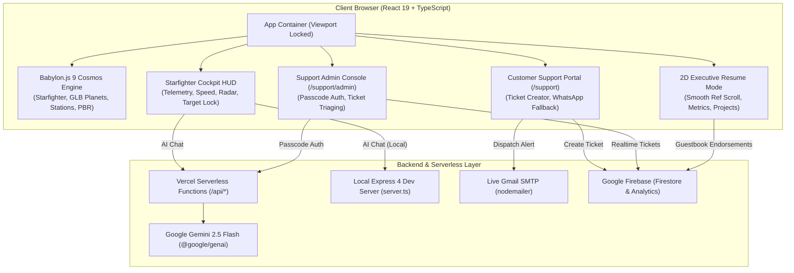

<div align="center">

# 🚀 Shekhar Birda • 3D Interactive Cosmos & Executive Portfolio
### *Senior React Native & React.js Architect • Realistic Babylon.js 3D Cosmos Experience*

[](https://react.dev/)
[](https://www.typescriptlang.org/)
[](https://www.babylonjs.com/)
[](https://tailwindcss.com/)
[](https://ai.google.dev/)
[](https://firebase.google.com/)
[](https://vercel.com/)

<p align="center">
  <b>Pilot a high-fidelity starfighter through an authentic, photorealistic 3D universe powered by Babylon.js and Sketchfab 3D assets.</b><br/>
  Real-world production projects exist as celestial planetary bodies, orbiting space stations, and asteroid belts.<br/>
  Includes an <b>AI Engineering Copilot (Gemini 2.5 Flash)</b>, an instant <b>2D Executive Resume Mode</b> for recruiters, a full-featured <b>Customer Support & Admin Console</b>, and <b>Live Gmail SMTP & Firestore Realtime Integration</b>.
</p>

[🌌 Live 3D Experience](#-key-features) • [🛸 Flight Controls](#-cockpit-controls--hud) • [🪐 Planetary System & 3D Assets](#-realistic-3d-celestial-assets--sketchfab-pipeline) • [🎧 Support Suite](#-customer-support-suite--admin-console) • [⚙️ Architecture](#-system-architecture) • [⚡ Setup & Deploy](#-getting-started) • [📬 Connect](#-get-in-touch)

---

</div>

## 👨‍💻 About Shekhar Birda

**Shekhar Birda** is a **React Native & React.js Developer / Architect** based in Haryana, India, with over 2 years of proven engineering experience delivering mission-critical mobile and web applications. Specializing in high-performance frontend architecture, sub-second data synchronization, cross-platform mobile systems (iOS & Android), and fluid WebGL 3D graphics.

Shekhar has spearheaded core engineering flows across high-growth international platforms in the UAE and MENA region—ranging from food-waste sustainability networks serving tens of thousands of users to enterprise loyalty engines and AI career matching ecosystems.

### 📊 Production Impact At A Glance

| Metric | Achievement | Impact Description |
| :---: | :---: | :--- |
| 👥 | **12,000+** | Active mobile users served with **99.8% crash-free sessions** |
| 🏪 | **280+** | Merchant restaurant & bakery partners integrated across the UAE |
| 📱 | **5+** | Commercial-grade production applications deployed to App Store, Play Store & Web |
| ⚡ | **< 200ms** | Real-time database query latency with sub-second inventory locking |
| 🎓 | **8.0 / 10** | Academic GPA in Computer Engineering (Govt Polytechnic, Sirsa) |

---

## 🌟 What's New in this Release (`babylon-js`)

### 🪐 1. High-Fidelity Babylon.js 9 3D Cosmos Engine
- Rebuilt from the ground up using **Babylon.js 9** (`@babylonjs/core`, `@babylonjs/loaders`).
- **PBR (Physically Based Rendering)** materials with realistic metallic-roughness workflows, environmental reflections, solar lighting, and glow layer post-processing.
- **Dynamic Starfighter Flight**: 6-DOF flight controller with atmospheric drag, banking turns, hyper-boost warp effects, plasma particle thrusters, and collision detection.

### 🛰️ 2. Photorealistic Sketchfab 3D Asset Pipeline
- Integrated real-world 3D GLB assets downloaded directly from Sketchfab creators:
  - **The Sun (Sol)**: Pulsing solar core with emissive corona glow (`af2874610d5e4cbdbf49bc951b500bda`).
  - **Planets & Moons**: High-detail GLB models for Earth, Moon (Luna), Venus, Mars, Saturn (with rings), Uranus, Neptune, and Pluto.
  - **Procedural PBR Fallbacks**: Dynamic procedural PBR shader generators for Mercury and Jupiter.
  - **Orbital Space Stations**: Citadel (`0da4a24e7edd49159737675ffcc06228`), Sensor Relay (`a7a6ad10261149cab31aa394bfcf8940`), and Deep-Core Modules (`e3ba39a1c78540448542cf937b11feab`).
  - **Space Traffic**: Autonomous NPC Scout Interceptors (`9a81a5167c474530881e55127e275c6c`) patrolling flight corridors.
  - **Asteroid Belts & Encounters**: Detailed Low & Medium Poly asteroid fields, plus encounters with an Ancient Meteorite (`0a503e5bec784cbc9082e2f6b2d9f701`) and a Hypervelocity Meteor (`d3a5a7e9a7d24b76841bf0f49d56a5f3`) with an ionization coma.
  - **Player Starfighter**: High-detail Light Fighter craft (`51616ef53af84fe595c5603cd3e0f3e1`).

### 🎧 3. Customer Support Portal & Admin Console
- **Customer Support Portal (`/support`)**: Multi-channel interactive portal with instant priority ticket creation, direct WhatsApp routing, and email outreach.
- **Support Admin Dashboard (`/support/admin`)**: Restricted console secured by admin passcode (`SHEKHAR999`) for ticket triaging, status transitions (Open, Pending, Resolved), customer detail lookup, and internal engineering notes.

### 📬 4. Live Gmail SMTP & Multi-Channel Alert Engine
- **Direct Email Dispatch**: Powered by `nodemailer` with secure Gmail App Password credentials to deliver recruiter inquiries and customer support tickets straight to your Gmail inbox (`shekharjaat751@gmail.com`).
- **Fail-Safe Fallbacks**: Immediate one-click WhatsApp messaging (`+91 9996231869`) and Web Gmail direct-compose links ensure 100% communication reliability.

### 🛡️ 5. Google Firebase Firestore Security & Telemetry
- Deployed production security rules ([`firestore.rules`](file:///d:/projects/Portfolio-React/shekhar-birda-_-3d-interactive-portfolio/firestore.rules)) guaranteeing verified read/write access for `inquiries`, `guestbook`, and `support_tickets`.
- Live Firestore synchronization counter card on the Support Admin Dashboard.
- Integrated Firebase Analytics tracking for all cosmic sessions and user interactions.

---

## 🛸 Cockpit Controls & HUD

| Action | Keyboard Key | Mouse / Touch Gesture |
| :--- | :---: | :--- |
| **Accelerate / Thrust Forward** | <kbd>W</kbd> / <kbd>↑</kbd> | Tap Accelerate / Virtual Joystick Up |
| **Reverse / Airbrake** | <kbd>S</kbd> / <kbd>↓</kbd> | Tap Brake / Virtual Joystick Down |
| **Pitch & Yaw (Turn Left/Right)** | <kbd>A</kbd> / <kbd>D</kbd> or <kbd>←</kbd> / <kbd>→</kbd> | Mouse Drag or Virtual Joystick |
| **Hyperjump / Boost Warp** | <kbd>Space</kbd> | Tap Boost Button on HUD |
| **Precision Glide / Decelerate** | <kbd>Shift</kbd> | Tap Airbrake on HUD |
| **Inspect Planet / Project** | *Target Lock in Range* | Click on Planet or Orbiting Moon |
| **Toggle Executive Resume Mode** | Click **"Resume View"** on HUD | Toggle Mode Button |
| **Open AI Copilot** | Click **"AI Copilot"** on HUD | Cockpit Assistant Button |
| **Support Portal** | Click **"Support"** on HUD / Navigate to `/support` | Access Support Ticket Portal |
| **Admin Console** | Navigate to `/support/admin` | Passcode: `SHEKHAR999` |

---

## 🪐 Realistic 3D Celestial Assets & Sketchfab Pipeline

| Body / Object | Source & Sketchfab UID | Visual Representation & Role |
| :--- | :--- | :--- |
| **The Sun** | `af2874610d5e4cbdbf49bc951b500bda` | Central star with custom emissive solar flare corona |
| **Earth** | `072ccdc6820c4cb698349d9b71089269` | MyBooky Production Case Study |
| **Moon (Luna)** | `26cc0b7878bb4d919b68e2be399db466` | Orbiting Earth with realistic crater geometry |
| **Mercury** | Procedural PBR Fallback | Snibbl Food Waste Platform Flagship |
| **Venus** | `d497ce25553447f3b7b679110c85cfa1` | EDU-Match AI Platform |
| **Mars** | `f98432cf20aa426fb3bd299f699ffd51` | Magrudy's Enterprise Omnichannel Loyalty |
| **Jupiter** | Procedural PBR Fallback | Gulf Bar Show Companion App |
| **Saturn** | `9a279abdabc740419474d2b03dbadb59` | Skills Matrix with integrated planetary rings |
| **Uranus** | `0009a69dbace44608c0bd09af9ba20db` | Deep-space telemetry node |
| **Neptune** | `7e7632f6e16b4aaaa7597b9ff91b47b2` | Outer system boundary |
| **Pluto** | `82bec3a4536c4a608c3b6e219b16a824` | Kuiper belt outpost |
| **Player Fighter** | `51616ef53af84fe595c5603cd3e0f3e1` | Light Fighter with dual plasma thrusters |
| **NPC Patrol** | `9a81a5167c474530881e55127e275c6c` | Autonomous space traffic along inner corridors |
| **Space Stations** | `0da4a24e7edd...` / `a7a6ad10...` | Citadel, Relay & Refinery orbital installations |
| **Asteroids** | `24572b5eec...` / `2dc6d949...` | 100 Low & Med Poly belts + Ceres, Vesta, Pallas |

*Full license details and creator attributions are listed in [`ASSET_CREDITS.md`](file:///d:/projects/Portfolio-React/shekhar-birda-_-3d-interactive-portfolio/ASSET_CREDITS.md).*

---

## 🎧 Customer Support Suite & Admin Console

The portfolio includes an enterprise-grade customer support suite:

1. **Customer Support Portal (`/support`)**:
   - Live ticket creation with category tagging (`Technical Question`, `Project Inquiry`, `Bug Report`, `Feature Request`).
   - Priority levels: `Low`, `Medium`, `High`, `Urgent`.
   - Automatic dispatch to both Firebase Firestore and real-time email notification.
2. **Support Admin Console (`/support/admin`)**:
   - Protected by administrative passcode (default: `SHEKHAR999`, customizable via `AUTH_SECRET`).
   - Filter tickets by status: `All`, `Open`, `In Progress`, `Resolved`.
   - Update ticket status, view customer contact metadata, and write internal notes.
   - Synchronized live metric cards for Firestore collections.

---

## ⚙️ System Architecture



---

## ⚡ Getting Started

### Prerequisites
- **Node.js** (v18.0 or later)
- **npm** (v9.0 or later)

### 1. Clone & Checkout Branch
```bash
git clone https://github.com/SHEKHAR3512/shekhar-birda-_-3d-interactive-portfolio.git
cd shekhar-birda-_-3d-interactive-portfolio
git checkout babylon-js
```

### 2. Install Dependencies
```bash
npm install
```

### 3. Configure Environment Variables
Create a `.env` file in the root directory (see `.env.example`):
```env
# Support Admin Passcode
AUTH_SECRET="SHEKHAR999"

# Google Gemini API Key (Required for AI Copilot)
GEMINI_API_KEY=""

# Email Notifications (Gmail SMTP)
EMAIL_HOST="smtp.gmail.com"
EMAIL_PORT="465"
EMAIL_USER="your_email@gmail.com"
EMAIL_PASSWORD="your_16_char_google_app_password"
NOTIFICATION_EMAIL="your_email@gmail.com"
SUPPORT_EMAIL="your_email@gmail.com"
SENDER_NAME="Shekhar Birda Portfolio"

# Google Firebase Configuration
VITE_FIREBASE_API_KEY="your_firebase_api_key"
VITE_FIREBASE_AUTH_DOMAIN="shekhar-jaat-portfolio.firebaseapp.com"
VITE_FIREBASE_PROJECT_ID="shekhar-jaat-portfolio"
VITE_FIREBASE_STORAGE_BUCKET="shekhar-jaat-portfolio.firebasestorage.app"
VITE_FIREBASE_MESSAGING_SENDER_ID="28064232504"
VITE_FIREBASE_APP_ID="your_firebase_app_id"
VITE_FIREBASE_MEASUREMENT_ID="G-V9FY552BQB"
```

### 4. Run Development Server
```bash
npm run dev
```
Open [http://localhost:3000](http://localhost:3000) in your browser.

---

## 🚢 Deployment Guide

### Deploying to Vercel

This repository includes native Vercel configuration ([`vercel.json`](file:///d:/projects/Portfolio-React/shekhar-birda-_-3d-interactive-portfolio/vercel.json)) and Serverless Functions (`/api/*`):

1. **Push Branch to GitHub**:
   ```bash
   git push -u origin babylon-js
   ```
2. In your [Vercel Dashboard](https://vercel.com/new), import the repository and select the `babylon-js` branch.
3. Configure the environment variables in Vercel Project Settings:
   - `AUTH_SECRET`: `SHEKHAR999`
   - `EMAIL_HOST`, `EMAIL_PORT`, `EMAIL_USER`, `EMAIL_PASSWORD`, `NOTIFICATION_EMAIL`
   - `VITE_FIREBASE_*` variables
   - `GEMINI_API_KEY` (if using Gemini AI)
4. Deploy! Vercel builds the bundle via Vite and mounts all serverless API endpoints automatically.

### Standalone Production Server (Node.js)
```bash
npm run build:server
npm run start
```

---

## 📬 Get in Touch

I am always open to discussing new opportunities, architectural consulting, and full-time senior engineering roles.

<div align="center">

[](https://www.linkedin.com/in/shekhar-birda-279763353/)
[](https://github.com/SHEKHAR3512)
[](https://wa.me/919996231869)
[](tel:+919996231869)
[](mailto:shekharjaat751@gmail.com)

<br/>

```
📍 Location: Haryana / Remote, India
💼 Availability: Open to Senior React Native / React.js Engineering & Architectural Roles
```

---

<sub>Designed & Engineered by **Shekhar Birda** • Built with React 19, Babylon.js 9 & Tailwind CSS v4</sub>

</div>
