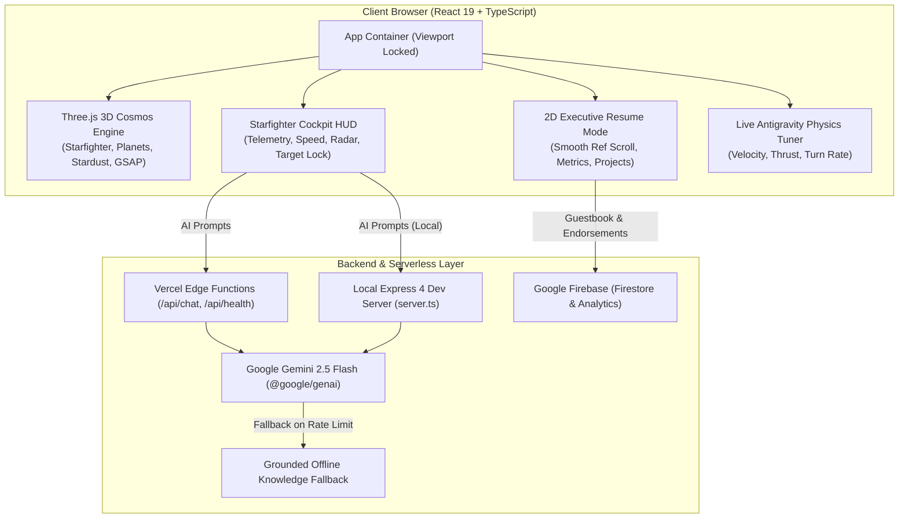

<div align="center">

# 🚀 Shekhar Birda • 3D Interactive Cosmos & Executive Portfolio
### *Senior React Native & React.js Architect • WebGL Cosmos Experience*

[](https://react.dev/)
[](https://www.typescriptlang.org/)
[](https://threejs.org/)
[](https://tailwindcss.com/)
[](https://ai.google.dev/)
[](https://firebase.google.com/)
[](https://vercel.com/)

<p align="center">
  <b>Pilot a starfighter through an interactive 3D universe where real-world production projects and architectural skills exist as planetary bodies, celestial rings, and orbiting satellites.</b><br/>
  Featuring an <b>AI Engineering Copilot (Gemini 2.5 Flash)</b>, an instant <b>2D Executive Resume Mode</b> for recruiters, and <b>Realtime Firebase Endorsements</b>.
</p>

[🌌 Live 3D Experience](#-key-features) • [👨‍💻 About Shekhar](#-about-shekhar-birda) • [🛸 Flight Controls](#-cockpit-controls--hud) • [🪐 Production Projects](#-featured-projects-planetary-dossiers) • [⚙️ Architecture](#-system-architecture) • [⚡ Setup & Deploy](#-getting-started) • [📬 Connect](#-get-in-touch)

---

</div>

## 👨‍💻 About Shekhar Birda

**Shekhar Birda** is a **React Native & React.js Developer / Architect** based in Haryana, India, with over 2 years of proven engineering experience delivering mission-critical mobile and web applications. Specializing in high-performance frontend architecture, sub-second data synchronization, cross-platform mobile systems (iOS & Android), and fluid WebGL graphics.

Shekhar has spearheaded core engineering flows across high-growth international platforms in the UAE and MENA region—ranging from food-waste sustainability networks serving tens of thousands of users to enterprise loyalty engines and AI career matching ecosystems.

### 📊 Production Impact At A Glance

| Metric | Achievement | Impact Description |
| :---: | :---: | :--- |
| 👥 | **12,000+** | Active mobile users served with **99.8% crash-free sessions** |
| 🏪 | **280+** | Merchant restaurant & bakery partners integrated across the UAE |
| 📱 | **5+** | Commercial-grade production applications deployed to App Store, Play Store & Web |
| ⚡ | **< 200ms** | Real-time database query latency with sub-second inventory locking |
| 🎓 | **8.0 / 10** | Academic GPA in Computer Engineering (Govt Polytechnic, Sirsa) |

---

## 🌟 Key Features

### 🎮 1. Immersive 3D WebGL Flight Simulator
- **Realistic Starfighter Physics**: Three.js flight mechanics with velocity damping, banking turns, acceleration thrust, hyperjump warp drives, and dynamic stardust particle trails.
- **Solar Planetary System**: Real production projects and core skill domains are mapped to 3D planetary bodies (Mercury, Venus, Earth, Mars, Jupiter, Saturn) complete with atmospheric glows, moons, and orbital paths.
- **Flight Telemetry HUD**: Cockpit HUD rendering live speed, world coordinates, radar compass, target locking, autopilot navigation, and flight controls.

### 🤖 2. Gemini 2.5 Flash AI Engineering Copilot
- **Conversational Intelligence**: Integrated AI copilot powered by Google's `@google/genai` (Gemini 2.5 Flash).
- **Grounded Offline Fallback**: Zero downtime. If offline or rate-limited, an intelligent fallback engine answers technical questions directly from Shekhar's pre-compiled portfolio knowledge base.
- **Prompt Injection Defense & Rate Limiting**: Built-in security guards prevent system prompt leaks and protect backend quotas.

### 💼 3. 2D Executive Resume Mode
- **Recruiter & Hiring Manager Friendly**: One-click switch between the 3D cosmos and an ultra-fast, high-contrast 2D executive portfolio.
- **Deep Case Studies & Metrics**: Comprehensive project summaries, responsibilities, technical stacks, and direct links to live products.
- **Instant vCard & Direct Contact**: Instant vCard export, direct WhatsApp messaging, one-tap calling, and email outreach.

### 🎛️ 4. Antigravity Live Physics Tuner
- **Real-Time Simulation Tuning**: Open the live tuner modal to adjust Top Velocity, Acceleration Thrust, Turn Sensitivity, and Jump Force with immediate tactile feedback on the 3D spaceship.

### 💬 5. Firebase Realtime Endorsements & Guestbook
- **Live Peer Recommendations**: Realtime Firestore-backed guestbook enabling recruiters, collaborators, and peers to leave recommendations.
- **Telemetry & Analytics**: Firebase Analytics integration tracking visitor engagement across cosmic sessions.

---

## 🛸 Cockpit Controls & HUD

| Action | Keyboard Key | Mouse / Touch Gesture |
| :--- | :---: | :--- |
| **Accelerate / Thrust Forward** | <kbd>W</kbd> / <kbd>↑</kbd> | Tap Accelerate / Virtual Joystick Up |
| **Reverse / Airbrake** | <kbd>S</kbd> / <kbd>↓</kbd> | Tap Brake / Virtual Joystick Down |
| **Pitch & Yaw (Turn Left/Right)** | <kbd>A</kbd> / <kbd>D</kbd> or <kbd>←</kbd> / <kbd>→</kbd> | Mouse Drag or Virtual Joystick |
| **Hyperjump / Boost Warp** | <kbd>Space</kbd> | Tap Boost Button on HUD |
| **Precision Glide / Decelerate** | <kbd>Shift</kbd> | Tap Airbrake on HUD |
| **Inspect Planet / Project** | *Target Lock in Range* | Click on Planet or Orbiting Moon |
| **Toggle Executive Resume Mode** | Click **"Resume View"** on HUD | Toggle Mode Button |
| **Open AI Copilot** | Click **"AI Copilot"** on HUD | Cockpit Assistant Button |

---

## 🪐 Featured Projects (Planetary Dossiers)

### 1. 🍏 [Snibbl — Food Waste Reduction Mobile Platform](https://snibbl.com/)
> *Mercury • Flagship Mobile Application*
- **Role**: Lead Mobile Engineer (Apptunix)
- **Tech Stack**: `React Native`, `TypeScript`, `Redux Toolkit`, `Firebase Realtime DB`, `REST APIs`, `Fastlane`
- **Key Achievements**:
  - Rescued **50,000+ surplus food bags** across **280+ partner merchants** in the UAE.
  - Scaled React Native app to **12,000+ active users** with **99.8% crash-free session stability**.
  - Engineered sub-second inventory sync and instant stock-locking checkout with Firebase Realtime DB.

### 2. 🎓 [EDU-Match — AI-Driven Academic & Career Platform](https://edumatchconnect.ai/)
> *Venus • AI Matching Platform*
- **Role**: Frontend & State Architect (Apptunix)
- **Tech Stack**: `React.js`, `TypeScript`, `Redux Toolkit`, `Firebase Auth`, `Firestore`, `Tailwind CSS`
- **Key Achievements**:
  - Built an AI career-matching engine delivering **94% recommendation accuracy**.
  - Role-based security with Firebase Authentication for **100+ educational institutions**.
  - Sub-200ms query response latency with modular Redux Toolkit architecture.

### 3. 💈 [MyBooky — UAE Clinic & Salon On-Demand Booking](https://mybooky.app)
> *Earth • On-Demand Booking Hub*
- **Role**: Full-Stack Mobile Engineer (Apptunix)
- **Tech Stack**: `React Native`, `React.js`, `TypeScript`, `Firebase`, `Redux Toolkit`, `Node.js`
- **Key Achievements**:
  - Cut average appointment booking time to **< 30 seconds** across **150+ partner clinics & salons**.
  - Reduced client no-shows by **45%** with automated multi-channel WhatsApp & SMS reminder queues.
  - Implemented offline-first caching and conflict-resolution algorithms for concurrent booking slots.

### 4. 📚 [Magrudy's — Omnichannel Loyalty & Rewards Platform](https://www.magrudy.com/)
> *Mars • Enterprise Retail & Loyalty*
- **Role**: Lead Frontend Engineer (Apptunix)
- **Tech Stack**: `React.js`, `TypeScript`, `Material UI`, `Redux Toolkit`, `REST APIs`
- **Key Achievements**:
  - Unified **14 physical retail bookstores** and e-commerce into a single rewards program for **25,000+ members**.
  - Boosted repeat order velocity by **+38%** through personalized point redemption vouchers.
  - Built digital barcode scanning and Apple Wallet / Google Pay pass generation.

### 5. 🍸 [Gulf Bar Show — MENA Trade Show Companion App](https://gulfbarshow.com/)
> *Jupiter • Grand Expo PWA*
- **Role**: Frontend Engineer (Apptunix)
- **Tech Stack**: `React.js`, `TypeScript`, `Tailwind CSS`, `PWA`, `REST APIs`
- **Key Achievements**:
  - Official digital companion for **5,000+ attendees** and **120+ international exhibitors** at Dubai World Trade Centre.
  - Interactive exhibition floorplan with booth navigation, schedule bookmarks, and masterclass registration.
  - Maintained **100% uptime** during peak exhibition hours.

---

## 🛠️ Technical Stack & Skills Matrix

```
┌────────────────────────────────────────────────────────────────────────┐
│                        SHEKHAR BIRDA TECH STACK                        │
├───────────────────┬───────────────────┬────────────────────────────────┤
│ DOMAIN            │ TECHNOLOGIES      │ PROFICIENCY / SPECIALIZATION   │
├───────────────────┼───────────────────┼────────────────────────────────┤
│ Mobile Core       │ React Native      │ 92% • iOS/Android Architecture │
│ Frontend Core     │ React.js 19       │ 95% • High-Performance Web Apps│
│ Full-Stack SSR    │ Next.js           │ 88% • App Router, SSR/SSG      │
│ Language          │ TypeScript        │ 90% • Strict Typing & Generics │
│ 3D Graphics       │ Three.js & GSAP   │ 85% • WebGL, Shaders, Physics  │
│ State Management  │ Redux Toolkit     │ 92% • RTK Query, Offline Sync  │
│ Styling & UI      │ Tailwind CSS v4   │ 94% • Atomic Design, Tokens    │
│ Cloud & Realtime  │ Google Firebase   │ 90% • Firestore, Realtime DB   │
│ AI / LLM          │ Gemini 2.5 Flash  │ 88% • Prompts, Guards, Fallback│
│ DevOps & Deploy   │ Vercel, Git, CI/CD│ 88% • Zero Cold-Start Edge     │
└───────────────────┴───────────────────┴────────────────────────────────┘
```

---

## ⚙️ System Architecture



---

## ⚡ Getting Started

### Prerequisites
- **Node.js** (v18.0 or later)
- **npm** (v9.0 or later) or **bun**

### 1. Clone the Repository
```bash
git clone https://github.com/SHEKHAR3512/shekhar-birda-_-3d-interactive-portfolio.git
cd shekhar-birda-_-3d-interactive-portfolio
```

### 2. Install Dependencies
```bash
npm install
```

### 3. Configure Environment Variables
Create a `.env` file in the root directory:
```env
# Google Gemini API Key (Required for AI Copilot)
GEMINI_API_KEY=your_gemini_api_key_here

# Firebase Configuration (Required for Realtime Guestbook & Analytics)
VITE_FIREBASE_API_KEY=your_firebase_api_key
VITE_FIREBASE_AUTH_DOMAIN=
VITE_FIREBASE_PROJECT_ID=
VITE_FIREBASE_STORAGE_BUCKET=
VITE_FIREBASE_MESSAGING_SENDER_ID=
VITE_FIREBASE_APP_ID=your_firebase_app_id
VITE_FIREBASE_MEASUREMENT_ID=
```

### 4. Run Development Server
```bash
npm run dev
```
Open [http://localhost:3000](http://localhost:3000) in your browser to launch the 3D Cosmos.

---

## 🚢 Deployment Guide

### Deploying to Vercel (1-Click Ready)

This repository is optimized for **zero-configuration deployment on Vercel**:
1. Push your code to GitHub:
   ```bash
   git push origin main
   ```
2. In your [Vercel Dashboard](https://vercel.com/new), import the repository.
3. Add the following **Environment Variables** in the Vercel project settings:
   - `GEMINI_API_KEY`
   - `VITE_FIREBASE_API_KEY`
   - `VITE_FIREBASE_AUTH_DOMAIN`
   - `VITE_FIREBASE_PROJECT_ID`
   - `VITE_FIREBASE_STORAGE_BUCKET`
   - `VITE_FIREBASE_MESSAGING_SENDER_ID`
   - `VITE_FIREBASE_APP_ID`
   - `VITE_FIREBASE_MEASUREMENT_ID`
4. Click **Deploy**. Vercel will automatically build the client bundle via Vite and mount serverless handlers from `/api`.

### Standalone Production Build (Node.js / Self-Hosted)
```bash
# 1. Build client bundle + bundle server.cjs via esbuild
npm run build:server

# 2. Run standalone Node.js production server
npm run start
```

---

## 🏆 Engineering & Performance Highlights

- **WebGL Delta-Time Clamping**: Spacecraft and planetary orbital calculations use strict delta-time clamping to prevent frame drops or stutter on 144Hz+ and high-refresh mobile displays.
- **Instanced Mesh Asteroids**: Asteroid belts feature instanced geometries with customized rotation vectors, maintaining a rock-solid 60 FPS.
- **Zero Viewport Leakage**: `#root` uses a locked viewport (`h-screen overflow-hidden`) with dedicated programmatic scrolling containers (`h-full overflow-y-auto`) for the Executive Resume, guaranteeing flawless navigation without browser scroll locks.
- **Cross-Platform Compatibility**: Supports desktop keyboard/mouse navigation and mobile multi-touch virtual joysticks seamlessly.

---

## 📬 Get in Touch

I am always open to discussing new opportunities, architectural consulting, and full-time senior engineering roles.

<div align="center">

[](https://www.linkedin.com/in/shekhar-birda-279763353/)
[](https://github.com/SHEKHAR3512)
[](https://wa.me/919996231869)
[](tel:+919996231869)
[](mailto:shekharbirda@gmail.com)

<br/>

```
📍 Location: Haryana / Remote, India
💼 Availability: Open to Senior React Native / React.js Engineering & Architectural Roles
```

---

<sub>Designed & Engineered by **Shekhar Birda** • Built with React 19, Three.js & Tailwind CSS v4</sub>

</div>
